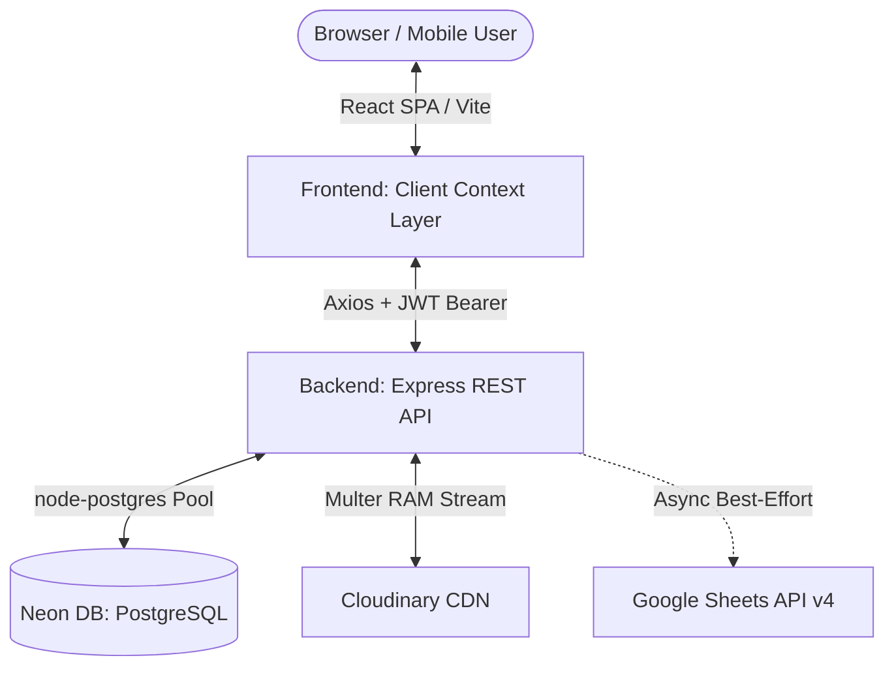
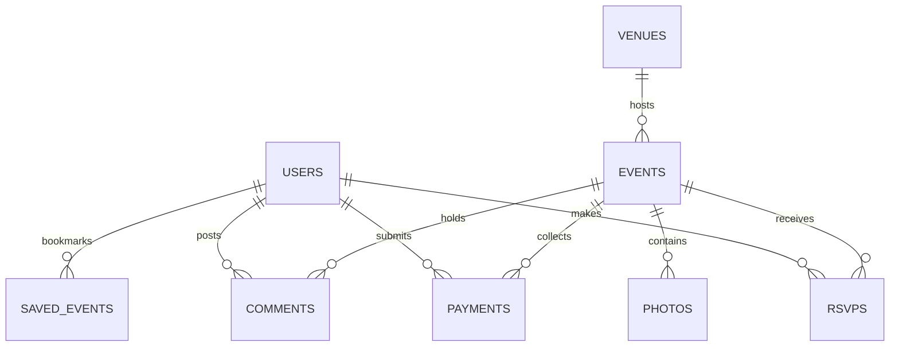

# Business 4.0 — Full-Stack Community Platform & Interview Master Guide

> **Business 4.0** is a full-stack web application designed for managing fortnightly business meetups, networking events, ticket RSVPs with UPI payment proof verification, photo galleries, newsletter subscriptions, and organizer showcases in Delhi NCR.

---

## 📋 Table of Contents
1. [Architecture Overview](#1-architecture-overview)
2. [Tech Stack Summary](#2-tech-stack-summary)
3. [Database Architecture & All 11 Neon DB Tables](#3-database-architecture--all-11-neon-db-tables)
4. [Complex Subsystems & Source Code Deep-Dive](#4-complex-subsystems--source-code-deep-dive)
   - [A. Multer In-Memory Buffer Processing (`upload.js`)](#a-multer-in-memory-buffer-processing-uploadjs)
   - [B. Cloudinary Buffer Streaming & Folder Architecture (`cloudinary.js`)](#b-cloudinary-buffer-streaming--folder-architecture-cloudinaryjs)
   - [C. Dynamic SVG QR Code & UPI Intent (`QRCode.jsx` & `payment.js`)](#c-dynamic-svg-qr-code--upi-intent-qrcodejsx--paymentjs)
   - [D. Atomic Postgres ACID Transactions for RSVPs (`rsvp.controller.js`)](#d-atomic-postgres-acid-transactions-for-rsvps-rsvpcontrollerjs)
   - [E. Google Sheets API v4 Service Account Sync (`sheets.js`)](#e-google-sheets-api-v4-service-account-sync-sheetsjs)
   - [F. JWT Authentication & Bearer Interceptors (`auth.controller.js` & `client.js`)](#f-jwt-authentication--bearer-interceptors-authcontrollerjs--clientjs)
   - [G. Postgres DATE Type Parser Timezone Fix (`db.js`)](#g-postgres-date-type-parser-timezone-fix-dbjs)
5. [Complete API Route Map](#5-complete-api-route-map)
6. [Interview "Why Questions" & Strategic Answers](#6-interview-why-questions--strategic-answers)

---

## 1. Architecture Overview

The system uses a **Decoupled Architecture**:
- **Frontend SPA**: React 18 + Vite + Custom Vanilla CSS Design System + Context API (`AuthContext`, `EventsContext`, `RsvpContext`, `SavedEventsContext`).
- **Backend API**: Node.js + Express (ES Modules) + REST API endpoints.
- **Database Layer**: Serverless PostgreSQL via **Neon DB** (`pg` connection pool, `pgcrypto` for UUIDs).
- **Asset Storage**: **Cloudinary** for image CDN storage (cover banners, gallery photos, payment screenshots, team avatars).
- **Secondary Persistence**: **Google Sheets API v4** service account for real-time background mirroring of RSVPs and contact inquiries.



---

## 2. Tech Stack Summary

| Layer | Technology | Key Details |
| :--- | :--- | :--- |
| **Frontend** | React 18, Vite | React Router v6, Context API, Vanilla CSS (Dark theme, glassmorphism, micro-animations). |
| **Backend** | Node.js, Express (ESM) | REST API, Custom async error handling, JWT auth middleware. |
| **Database** | PostgreSQL on **Neon DB** | Serverless Postgres, connection pooling (`pg`), `pgcrypto` UUIDs, JSONB. |
| **File Processing** | Multer (`memoryStorage`) | Buffers binary image uploads directly in Node.js RAM memory. |
| **Media Storage** | Cloudinary API | Cloud image CDN, custom folder structures, streaming upload buffers. |
| **Spreadsheet Sync** | Google Sheets API v4 | Service Account authentication (`googleapis`), auto-creating missing tabs. |
| **Authentication** | JWT + `bcryptjs` | Bearer tokens in HTTP headers, 10-round bcrypt password hashing. |

---

## 3. Database Architecture & All 11 Neon DB Tables

The database schema is defined in `server/src/db/schema.sql`. It consists of **11 PostgreSQL tables**:



### Table Breakdown:

#### 1. `users` (Accounts & Security)
Stores user credentials and roles.
- `id` (UUID, Primary Key, `default gen_random_uuid()`)
- `name` (TEXT, NOT NULL)
- `email` (TEXT, NOT NULL UNIQUE)
- `password_hash` (TEXT, NOT NULL) — bcrypt hash
- `role` (TEXT, default `'member'`, CHECK in `'member'`, `'admin'`)
- `created_at`, `updated_at` (TIMESTAMPTZ)

#### 2. `events` (Meetup Editions)
Stores fortnightly meetup listings.
- `id` (UUID, Primary Key)
- `event_date` (DATE, NOT NULL UNIQUE) — Natural key on frontend
- `title` (TEXT, default `'Business4.0 Meetup (Entry Fee Applicable)'`)
- `entry_fee` (INTEGER, default 150)
- `description` (TEXT[]) — Array of paragraphs
- `image_url` (TEXT), `image_public_id` (TEXT) — Cloudinary references
- `attendee_count` (INTEGER, default 0)
- `cancelled` (BOOLEAN, default false)
- `venue_id` (UUID, FK to `venues.id` ON DELETE SET NULL)
- `location_override` (JSONB)
- `created_at`, `updated_at` (TIMESTAMPTZ)

#### 3. `rsvps` (Meetup Attendance)
Tracks who is attending which meetup.
- `id` (UUID, Primary Key)
- `user_id` (UUID, FK to `users.id` ON DELETE CASCADE)
- `event_id` (UUID, FK to `events.id` ON DELETE CASCADE)
- `status` (TEXT, default `'going'`, CHECK in `'going'`, `'cancelled'`)
- `payment_ref` (TEXT) — Unique UPI reference string
- `created_at` (TIMESTAMPTZ)
- **Constraint**: `UNIQUE (user_id, event_id)`

#### 4. `payments` (UPI Entry-Fee Proof Verification)
Stores payment screenshot proofs submitted by members.
- `id` (UUID, Primary Key)
- `event_id` (UUID, FK to `events.id` ON DELETE SET NULL)
- `user_id` (UUID, FK to `users.id` ON DELETE SET NULL)
- `payer_name` (TEXT), `payer_email` (TEXT)
- `payment_ref` (TEXT)
- `amount` (INTEGER)
- `proof_url` (TEXT), `proof_public_id` (TEXT) — Cloudinary handles
- `status` (TEXT, default `'pending'`, CHECK in `'pending'`, `'verified'`, `'rejected'`)
- `created_at` (TIMESTAMPTZ)

#### 5. `venues` (Meetup Locations & Directions)
Stores meetup venue details and metro route guides.
- `id` (UUID, Primary Key)
- `name` (TEXT), `short_name` (TEXT), `address` (TEXT), `city` (TEXT), `gate` (TEXT), `entry_note` (TEXT)
- `metro` (JSONB) — `{ station, exit, walk, walkTo }`
- `helpline` (TEXT), `helpline_note` (TEXT)
- `is_default` (BOOLEAN, default false)

#### 6. `photos` (Gallery Photo Albums)
Stores photo gallery entries for each meetup.
- `id` (UUID, Primary Key)
- `event_id` (UUID, FK to `events.id` ON DELETE CASCADE)
- `url` (TEXT, NOT NULL), `public_id` (TEXT) — Cloudinary handles
- `alt` (TEXT), `position` (INTEGER, default 0)
- `created_at` (TIMESTAMPTZ)

#### 7. `saved_events` (User Bookmarks)
Tracks user's saved meetups across devices.
- `id` (UUID, Primary Key)
- `user_id` (UUID, FK to `users.id` ON DELETE CASCADE)
- `event_id` (UUID, FK to `events.id` ON DELETE CASCADE)
- `created_at` (TIMESTAMPTZ)
- **Constraint**: `UNIQUE (user_id, event_id)`

#### 8. `team_members` (Community Organizers)
Stores organizer details for team page.
- `id` (UUID, Primary Key)
- `name` (TEXT), `role` (TEXT, default `'Organiser'`)
- `image_url` (TEXT), `image_public_id` (TEXT), `linkedin_url` (TEXT)
- `position` (INTEGER, default 0)

#### 9. `comments` (Post-Meetup Discussion Threads)
Signed-in members leave feedback on past meetups.
- `id` (UUID, Primary Key)
- `event_id` (UUID, FK to `events.id` ON DELETE CASCADE)
- `user_id` (UUID, FK to `users.id` ON DELETE CASCADE)
- `body` (TEXT, NOT NULL)
- `created_at`, `updated_at` (TIMESTAMPTZ)

#### 10. `subscribers` (Newsletter Emails)
Footer newsletter signups.
- `id` (UUID, Primary Key)
- `email` (TEXT, NOT NULL UNIQUE)
- `created_at` (TIMESTAMPTZ)

#### 11. `contact_messages` (Support Form Submissions)
Contact form inquiries.
- `id` (UUID, Primary Key)
- `name` (TEXT), `email` (TEXT), `topic` (TEXT), `message` (TEXT)
- `created_at` (TIMESTAMPTZ)

---

## 4. Complex Subsystems & Source Code Deep-Dive

### A. Multer In-Memory Buffer Processing (`upload.js`)

**File**: `server/src/middleware/upload.js`

```javascript
import multer from "multer";

export const upload = multer({
  storage: multer.memoryStorage(),
  limits: { fileSize: 8 * 1024 * 1024 }, // 8 MB Limit
  fileFilter: (req, file, callback) => {
    if (file.mimetype.startsWith("image/")) callback(null, true);
    else callback(new Error("Only images can be uploaded."));
  },
});
```

#### How it works:
1. **`multer.memoryStorage()`**: Instructs Multer NOT to write uploaded files to temporary disk folders (`/tmp`). Instead, allocating raw binary bytes directly into Node.js **RAM memory** as a `Buffer` (`req.file.buffer`).
2. **RAM to Stream Handshake**: `req.file.buffer` holds the byte array in RAM. This allows Express to stream image bytes directly over an HTTPS socket to Cloudinary without local disk I/O operations.

---

### B. Cloudinary Buffer Streaming & Folder Architecture (`cloudinary.js`)

**File**: `server/src/config/cloudinary.js`

```javascript
import { v2 as cloudinary } from "cloudinary";
import { env } from "./env.js";

cloudinary.config({
  cloud_name: env.cloudinary.cloudName,
  api_key: env.cloudinary.apiKey,
  api_secret: env.cloudinary.apiSecret,
  secure: true,
});

export function uploadBuffer(buffer, subfolder = "") {
  const folder = [env.cloudinary.folder, subfolder].filter(Boolean).join("/");

  return new Promise((resolve, reject) => {
    const stream = cloudinary.uploader.upload_stream(
      { folder, resource_type: "image" },
      (error, result) => {
        if (error) return reject(error);
        resolve({ url: result.secure_url, publicId: result.public_id });
      },
    );
    stream.end(buffer); // Writes RAM byte buffer into outgoing HTTPS socket stream
  });
}

export function destroyAsset(publicId) {
  if (!publicId) return Promise.resolve();
  return cloudinary.uploader.destroy(publicId);
}
```

#### How it works:
- **`upload_stream`**: Creates a Node.js Writable Stream directly to Cloudinary servers.
- **`stream.end(buffer)`**: Pushes the binary RAM buffer through the socket and closes the stream.
- **Asset Cleanup**: `destroyAsset(publicId)` deletes images from Cloudinary when records are deleted in Postgres.

---

### C. Dynamic SVG QR Code & UPI Intent (`QRCode.jsx` & `payment.js`)

**Files**: `client/src/components/QRCode.jsx` & `client/src/data/payment.js`

```javascript
// Constructs standard UPI Intent URI:
const intent = `upi://pay?pa=business4.community@upi&pn=Business%204.0%20Community&am=150&cu=INR&tn=${reference}`;
```

```jsx
// Renders matrix as a SINGLE vector SVG path string (No static image files!):
export default function QRCode({ value, quiet = 4, className = "" }) {
  const code = encodeQR(value);
  const span = code.size + quiet * 2;
  let d = "";
  for (let r = 0; r < code.size; r++) {
    for (let c = 0; c < code.size; c++) {
      if (code.modules[r][c]) d += `M${c + quiet} ${r + quiet}h1v1h-1z`;
    }
  }
  return (
    <svg viewBox={`0 0 ${span} ${span}`} className={className}>
      <rect width={span} height={span} fill="#fff" />
      <path d={d} fill="currentColor" />
    </svg>
  );
}
```

---

### D. Atomic Postgres ACID Transactions for RSVPs (`rsvp.controller.js`)

**File**: `server/src/controllers/rsvp.controller.js`

```javascript
export const createRsvp = asyncHandler(async (req, res) => {
  const { eventId } = req.params;
  const client = await getClient();
  try {
    await client.query("BEGIN"); // Start transaction

    // 1. Upsert RSVP status to 'going'
    const { rows } = await client.query(
      `INSERT INTO rsvps (user_id, event_id, status, payment_ref)
       VALUES ($1, $2, 'going', $3)
       ON CONFLICT (user_id, event_id)
       DO UPDATE SET status = 'going', payment_ref = coalesce($3, rsvps.payment_ref)
       RETURNING *`,
      [req.user.id, eventId, req.body.paymentRef || null]
    );

    // 2. Increment attendee count atomically
    if (!wasGoing) {
      await client.query(
        "UPDATE events SET attendee_count = attendee_count + 1 WHERE id = $1",
        [eventId]
      );
    }

    await client.query("COMMIT"); // Commit transaction
    res.status(201).json({ rsvp: rows[0] });

    // 3. Best-effort Google Sheets sync
    if (!wasGoing) mirrorRsvpToSheet(req.user.id, eventId, req.body.paymentRef);
  } catch (err) {
    await client.query("ROLLBACK"); // Rollback on error
    throw err;
  } finally {
    client.release();
  }
});
```

---

### E. Google Sheets API v4 Service Account Sync (`sheets.js`)

**File**: `server/src/config/sheets.js`

```javascript
export async function appendRow(tabName, values) {
  const sheets = getSheets();
  if (!sheets) return false;

  try {
    await ensureTab(sheets, tabName); // Auto-creates missing tab & header row
    await sheets.spreadsheets.values.append({
      spreadsheetId: env.sheets.id,
      range: `${tabName}!A1`,
      valueInputOption: "USER_ENTERED",
      insertDataOption: "INSERT_ROWS",
      requestBody: { values: [values] },
    });
    return true;
  } catch (err) {
    console.error(`[sheets] append to "${tabName}" failed:`, err.message);
    return false; // Best-effort: never throws/rejects into HTTP request
  }
}
```

---

### F. JWT Authentication & Bearer Interceptors (`auth.controller.js` & `client.js`)

**Backend Signing** (`server/src/utils/jwt.js`):
```javascript
export function signToken(user) {
  return jwt.sign(
    { sub: user.id, role: user.role },
    env.jwtSecret,
    { expiresIn: "7d" }
  );
}
```

**Axios Interceptor** (`client/src/api/client.js`):
```javascript
api.interceptors.request.use((config) => {
  const token = getToken(); // Reads "b4:token" from localStorage
  if (token) config.headers.Authorization = `Bearer ${token}`;
  return config;
});
```

---

### G. Postgres DATE Type Parser Timezone Fix (`db.js`)

**File**: `server/src/config/db.js`

```javascript
// Force node-postgres to return DATE columns (OID 1082) as raw "YYYY-MM-DD"
// strings instead of JS Date objects, preventing UTC/IST timezone shift bugs.
pg.types.setTypeParser(1082, (value) => value);
```

---

## 5. Complete API Route Map

```
GET    /api/health                     - Health check probe (DB, Cloudinary, Sheets)

POST   /api/auth/register              - Register new user
POST   /api/auth/login                 - Login user & get JWT token
GET    /api/auth/me                    - Get current user profile (Auth)

GET    /api/events                     - List all meetups
GET    /api/events/:id                 - Get meetup detail by ID
POST   /api/events                     - Create new meetup (Admin + Multipart Cover)
PATCH  /api/events/:id                 - Update meetup (Admin + Multipart Cover)
DELETE /api/events/:id                 - Delete meetup (Admin)

POST   /api/events/:id/rsvp            - Confirm RSVP for meetup (Auth)
DELETE /api/events/:id/rsvp            - Cancel RSVP for meetup (Auth)
GET    /api/events/:id/rsvps           - List attendee list (Admin)
GET    /api/rsvps/me                   - List my RSVPs (Auth)

POST   /api/payments                   - Submit UPI screenshot proof (Multipart)
GET    /api/payments                   - List payments by status (Admin)
PATCH  /api/payments/:id               - Verify or Reject payment proof (Admin)

GET    /api/saved                      - List bookmarked event IDs (Auth)
PUT    /api/saved/:eventId             - Bookmark an event (Auth)
DELETE /api/saved/:eventId             - Remove bookmark (Auth)

GET    /api/events/:eventId/photos     - List photo gallery for event
POST   /api/events/:eventId/photos     - Upload photo to gallery (Admin + Multipart)
DELETE /api/photos/:id                 - Delete photo from gallery (Admin)

GET    /api/team                       - List team organizers
POST   /api/team                       - Add team member (Admin + Multipart Avatar)
PATCH  /api/team/:id                   - Update team member (Admin)
DELETE /api/team/:id                   - Delete team member (Admin)

GET    /api/venue                      - Get default venue & metro guide
PATCH  /api/venue/:id                  - Update venue & metro guide (Admin)

POST   /api/subscribers                - Subscribe to footer newsletter
POST   /api/contact                    - Submit contact form inquiry
```

---

## 6. Interview "Why Questions" & Strategic Answers

### Q1: Why PostgreSQL over MongoDB?
> **Answer**: Our application relies heavily on relational data integrity (Users $\rightarrow$ RSVPs $\rightarrow$ Events $\rightarrow$ Payments). Postgres enforces foreign keys, cascade deletes, and unique constraints. Additionally, Postgres supports `JSONB` for semi-structured data (like venue metro guides) and ACID transactions (`BEGIN ... COMMIT`) for concurrency control during RSVPs.

### Q2: Why `multer.memoryStorage()` over `diskStorage()`?
> **Answer**: `memoryStorage()` holds uploaded images temporarily in Node.js RAM (`req.file.buffer`), allowing us to stream them directly to Cloudinary over an HTTPS socket. This avoids server disk write overhead, eliminates temporary file cleanup scripts, and makes the backend compatible with serverless/containerized hosting environments where disk systems are read-only.

### Q3: Why Cloudinary over AWS S3 or Local Disk Storage?
> **Answer**: Cloudinary provides automated image optimization (converting to WebP/AVIF), responsive CDN delivery, and dynamic transformations out-of-the-box. Storing Base64 images inside Postgres would severely bloat database size and degrade query performance. Storing Cloudinary `url` and `public_id` strings keeps Postgres lightweight.

### Q4: Why Google Sheets API alongside PostgreSQL?
> **Answer**: Non-technical community managers need real-time access to attendee rosters and contact inquiries without querying SQL databases. We integrated Google Sheets API v4 as an asynchronous secondary mirror. It uses a **best-effort execution strategy** (wrapped in `try/catch`), ensuring that if Google’s API is down, user RSVPs remain 100% safe in PostgreSQL.

### Q5: Why JWT over Server-Side Sessions?
> **Answer**: JWTs are stateless—the server verifies authenticity using cryptographic signatures without querying a database or session store (like Redis) on every HTTP request. This makes scaling decoupled client-server SPA applications seamless.
